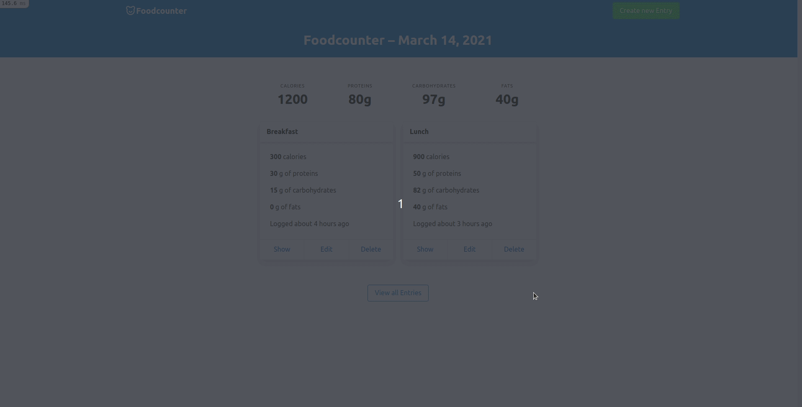

# Foodcounter
> Foodcounter is a calories, proteins, carbs and fats counter for your everyday meals. Simple and straightforward :)

Foodcounter allows you to register all of your daily meals and visualize, update our delete them freely. You can also see a history of your past meals :)

## Built With

- Ruby
- Ruby on Rails
- SQLite3
- Bulma Framework

## Getting Started
> Under construction

### Prerequisites

- Ruby
- Bundler
- Ruby on Rails
- Node.js
- Yarn (v >= 1.2 && < 2)

### Setup

Under construction

### Install

Under construction

### Usage

Under construction

### Run tests

Under construction

### Deployment

Under construction

## Authors

👤 **Fernando R P Marques**

- GitHub: [@fernandorpm](https://github.com/fernandorpm)
- Twitter: [@rpm_fernando](https://twitter.com/rpm_fernando)
- LinkedIn: [Fernando R P Marques](https://linkedin.com/in/fernandorpm)

## 🤝 Contributing

Contributions, issues, and feature requests are welcome!

Feel free to check the [issues page](../../issues/).

## Show your support

Give a ⭐️ if you like this project!

## Acknowledgments

- Hat tip to anyone whose code was used
- Inspiration
- etc

## 📝 License

This project is [MIT](./MIT.md) licensed.
